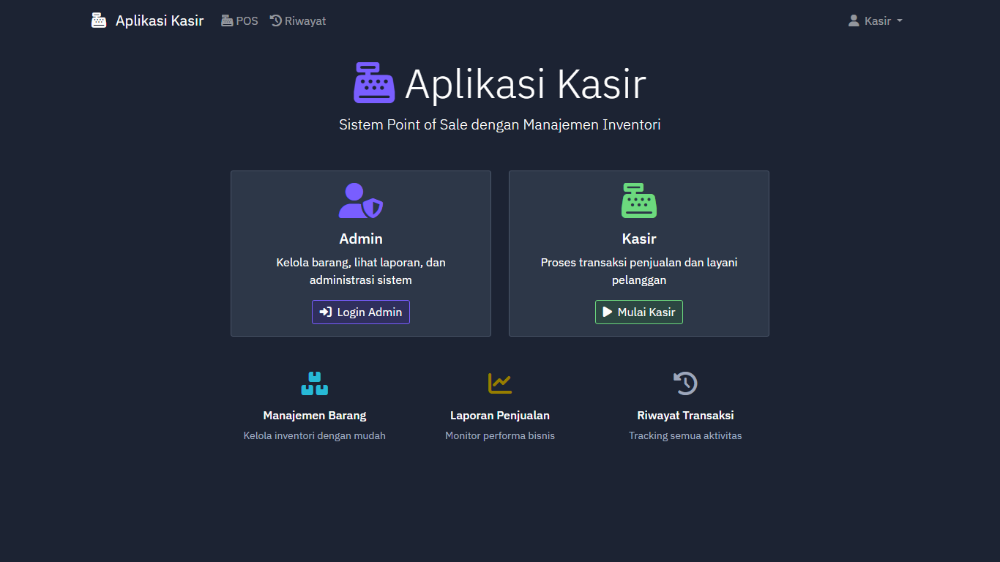
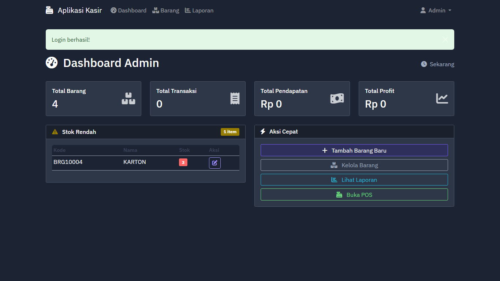
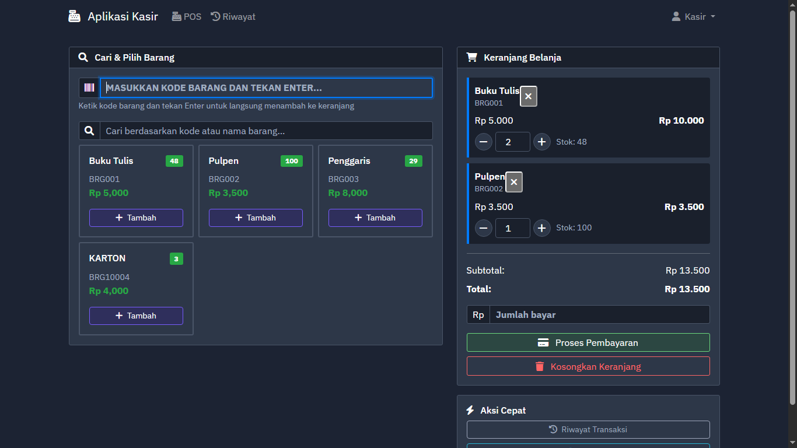

# KasirATK - Aplikasi Point of Sale (POS)

Aplikasi kasir modern berbasis web dengan manajemen inventori yang mudah digunakan. Dibangun dengan Flask dan Bootstrap untuk memberikan pengalaman pengguna yang optimal.



## 🚀 Fitur Utama

### 👨‍💼 Admin Dashboard
- **Manajemen Barang**: CRUD lengkap untuk inventori
- **Laporan Penjualan**: Statistik real-time dan analisis performa
- **Monitoring Stok**: Alert otomatis untuk stok rendah
- **Riwayat Transaksi**: Tracking semua aktivitas penjualan



### 💰 Kasir (POS)
- **Interface Intuitif**: Desain yang user-friendly untuk kasir
- **Quick Item Input**: Input kode barang langsung dengan Enter
- **Real-time Search**: Pencarian barang berdasarkan kode atau nama
- **Cart Management**: Keranjang belanja dengan perhitungan otomatis
- **Payment Processing**: Sistem pembayaran dengan kembalian



### 📊 Fitur Tambahan
- **Barcode Generation**: QR Code dan Barcode otomatis
- **Receipt Printing**: Struk digital dengan opsi cetak
- **Profit Calculation**: Perhitungan keuntungan real-time
- **Dark Theme**: Interface modern dengan tema gelap

## 🛠️ Teknologi

- **Backend**: Python Flask
- **Database**: SQLite
- **Frontend**: Bootstrap 5 + Font Awesome
- **Libraries**: 
  - QR Code generation (qrcode)
  - Barcode generation (python-barcode)
  - Image processing (Pillow)

## 🚀 Quick Start

### Persyaratan
- Python 3.11+
- Dependencies akan diinstall otomatis oleh Replit

### Instalasi
1. Fork atau clone repository ini
2. Jalankan aplikasi:
   ```bash
   python main.py
   ```
3. Buka browser dan akses `http://localhost:5000`

### Default Login Admin
- **Username**: `admin`
- **Password**: `admin123`

## 📖 Panduan Penggunaan

### Untuk Admin
1. Login melalui halaman admin dengan kredensial default
2. Kelola barang melalui menu "Kelola Barang"
3. Monitor penjualan di Dashboard
4. Lihat laporan detail di menu "Laporan"

### Untuk Kasir
1. Akses langsung menu "Mulai Kasir" dari halaman utama
2. Cari barang dengan search box atau input kode langsung
3. Tambahkan barang ke keranjang
4. Proses pembayaran dan cetak struk

## 🗂️ Struktur Database

### Tabel `barang`
- `id`: Primary key
- `kode`: Kode unik barang
- `nama`: Nama barang
- `harga_awal`: Harga beli/modal
- `harga_jual`: Harga jual
- `stok_awal`: Stok awal
- `stok_akhir`: Stok saat ini
- `profit`: Total keuntungan

### Tabel `transactions`
- `id`: Primary key transaksi
- `timestamp`: Waktu transaksi
- `items`: JSON data item yang dibeli
- `total`: Total pembayaran
- `profit`: Keuntungan transaksi
- `payment_amount`: Jumlah uang yang dibayar
- `change_amount`: Kembalian

## 🔧 Konfigurasi

### Environment Variables
- `SESSION_SECRET`: Secret key untuk session (production)

### Port Configuration
- Default port: `5000`
- Accessible at: `http://0.0.0.0:5000`

## 📱 Fitur POS

### Quick Input
- Ketik kode barang dan tekan Enter
- Barang otomatis ditambahkan ke keranjang
- Stok akan dicek secara real-time

### Cart Management
- Ubah quantity dengan tombol +/-
- Hapus item individual
- Kosongkan keranjang sekaligus
- Perhitungan subtotal dan total otomatis

### Payment Processing
- Input jumlah bayar
- Perhitungan kembalian otomatis
- Validasi pembayaran
- Generate struk digital

## 📈 Pelaporan

### Dashboard Metrics
- Total barang
- Total transaksi
- Total pendapatan
- Total keuntungan
- Alert stok rendah

### Detailed Reports
- Penjualan harian
- Top selling items
- Profit analysis
- Transaction history

## 🔐 Keamanan

- Session-based authentication
- Role-based access control
- Input validation
- SQL injection protection

## 🚀 Deployment

Aplikasi ini siap deploy di Replit:
1. Pastikan semua dependencies terinstall
2. Set environment variables jika diperlukan
3. Jalankan dengan `python main.py`

## 🤝 Contributing

1. Fork repository
2. Buat feature branch
3. Commit changes
4. Push ke branch
5. Create Pull Request

## 📄 License

MIT License - feel free to use this project for your own purposes.

## 🆘 Support

Jika ada pertanyaan atau bug report, silakan buat issue di repository ini.

---

**Catatan**: Aplikasi ini menggunakan SQLite untuk penyimpanan data. Untuk production dengan traffic tinggi, pertimbangkan migrasi ke PostgreSQL atau MySQL.
